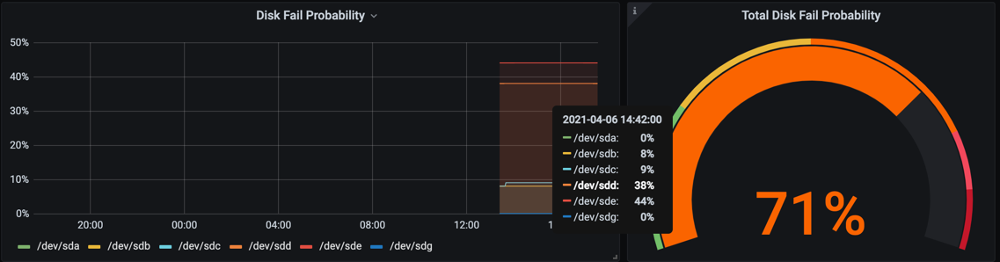

# snapraid-prometheus-collector
Text file collector for prometheus node_exporter, collecting values provided by snapraid and exporting them to Prometheus.

Available metrics:
* `snapraid_disk_fail_probability` probability to fail within the next year for each disk found by snapraid 
* `snapraid_total_fail_probability` probability for at least one failing disk within the next year

## Usage
* install and configure [Prometheus][1]
* install and configure [Node Exporter][2] for *Prometheus*
* enable [Textfile Collector][3] for *Node Exporter*
* download `snapraidColltor.sh` and configure cronjob for execution or similar, e.g.:

    * ```
      # executes collector once a day and outputs the result to a prometheus metrics file within the textfile collector directory
      0 12 * * * /usr/local/bin/snapraidCollector.sh > /var/lib/prometheus/textfile_collector/snapraid.prom
      ```
    * note: script must be run as root, since snapraid needs access to the hard drives


* use metrics listed above in Grafana or custom PromQL queries to visualize the results

  
## Shortcomings
* script won't check for compatible snapraid version, so it is much likely to break as the output format might change with new updates
* invalid values (e.g. n/a) reported by snapraid are not processed

[1]: https://prometheus.io/
[2]: https://github.com/prometheus/node_exporter
[3]: https://github.com/prometheus/node_exporter#textfile-collector